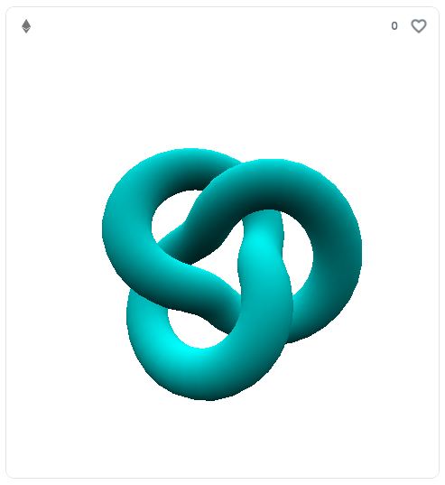
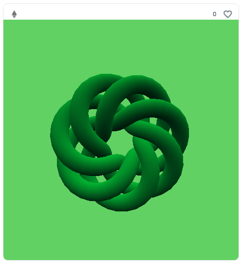
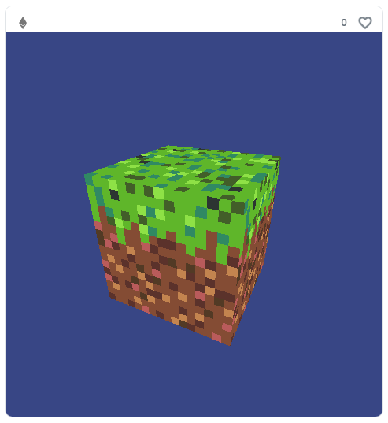
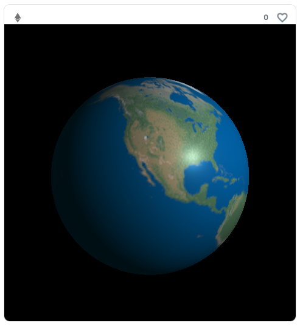

# On-Chain Three.js

## Setup

```
git clone https://github.com/NowAndNawoo/on-chain-threejs.git
cd on-chain-threejs
npm ci
cp .env.sample .env
```

## Sample1


https://testnets.opensea.io/ja/assets/goerli/0x4645cc106437f4c745ac823053bc3986a7bba03c/1

## Sample2


https://testnets.opensea.io/ja/assets/goerli/0x6c1ace7a0462b5f30908241a75fcbc01421655b8/5

## Sample3


https://testnets.opensea.io/ja/assets/goerli/0xd84a0963459ab2f1ad1c6ff580b8cba923f9da71/1

## Sample4


https://testnets.opensea.io/ja/assets/goerli/0xd71dfa7e758385483c410b7a9bd374a334dca226/1
